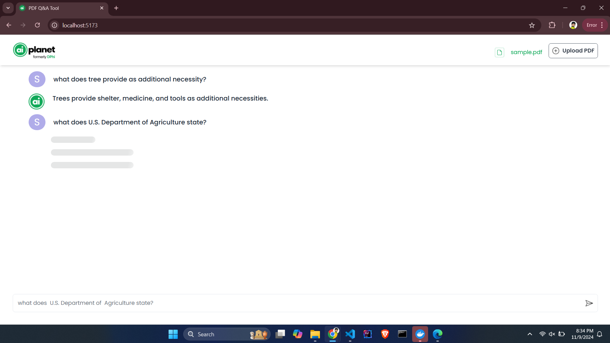

# PDF Querying Application

This application allows users to upload a PDF document,  ask questions about the document, and receive answers based on the content. It uses a full-stack setup with React on the frontend and a server backend using FastAPI, LangChain, SQLite, and other advanced tools for processing PDF content.

## Table of Contents

1. [Technologies](#technologies)
2. [Features](#features)
3. [Getting Started](#getting-started)
    - [Prerequisites](#prerequisites)
    - [Installation](#installation)
    - [Usage](#usage)
4. [Implementation Details](#implementation-details)

## Technologies
- **Frontend**: React, TailwindCSS, Daisy UI, React Hot toast
- **Backend**: FastAPI, Langchain, Groq, Gemma(Model), Google GenAI Embeddings
- **Database**: SQLite
- **Containerisation**: Docker, Docker Compose


## Features
- **PDF Upload**: Upload a PDF document to use as a knowledge source.
- **Question-Answering**: Type a question to retrieve an answer based on the content of the uploaded document.Real-Time Responses
- **Real-Time Responses**: Users get visual feedback during PDF upload, question processing, and answer generation.
- **Conversation History**: The app stores the questions and answers in a conversation history for reference.


## Getting Started
Follow these instructions to set up and run the project on your local machine.

### Prerequisites
- Node.js
- npm (or Yarn)
- Python (for backend)
- Virtual environment (recommended for backend dependencies)
- Docker
- Docker Compose

### Installation

#### Backend Setup
1. **Clone the Repository**:
   ```bash
   git clone git@github.com:Vaibhav-shrivastav/PDF_Querying_Application.git
   cd PDF_Querying_Application/server
   ```
2. **Create `.env` file**:
    - Kindly create `.env` file inside `server` directory.
    ```bash
    GOOGLE_API_KEY="your_api_key"
    GROQ_API_KEY="your_api_key"
    DATABASE_URL="sqlite:///./test.db"
    ```
    - Steps to Get API Keys:
        - GROQ Api Key: 
            - Log into Groq website and `Create API key` using this [link](https://console.groq.com/keys)
        - Google Api Key:
            - Open this [link](https://aistudio.google.com/apikey) and `Create API Key`
    - Copy your API keys and paste them in `.env` file as per the structure above.

<!--3. **Create Virtual Environment(if necessary)**:-->
<!--    - For Windows-->
<!--        ```bash-->
<!--        pip install virtualenv-->
<!--        python -m venv ./venv-->
<!--        venv\Scripts\activate-->
<!--        ```-->
<!--4. **Install Dependencies**:-->
<!--    ```bash-->
<!--        pip install -r requirements.txt-->
<!--    ```-->

#### Run Docker-Compose

1. **Go to root directory(PDF_Querying_Application) where `docker-compose.yml` file is located**
    ```bash
        cd ..
        docker-compose up --build
    ```

### Usage

1. Visit the frontend URL (http://localhost:5173) in your browser.
2. Upload a PDF file using the Upload PDF button.
3. Once the PDF is uploaded, enter a question in the input field at the bottom.
4. Submit your question to get a response based on the PDF's content.

## Implementation Details

### Frontend (React.js)

- **Context API :** Manages global state (e.g., document ID, conversation history, loading states) and shares it across components.
- **Tailwind CSS and Daisy UI:** For styling as UI libraries
- **React Hot Toast:** Provides user feedback with notifications for actions like successful PDF upload, errors, etc.
- **Axios :**  Handles HTTP requests between the frontend and backend server.

### Backend

- **LangChain:** Orchestrates the question-answering process by managing language models and generating responses.
- **SQLite:** Lightweight database used for storing uploaded document metadata and managing session information.
- **Groq:** Processes natural language questions about the uploaded document and generates structured queries.
- **Gemma:** Language model framework used for NLP processing.
- **Google GenAI Embeddings:** Generates embeddings from document content for semantic search and question-answering.
- **API Routes:**
    - `/upload_pdf/`: Accepts a PDF file and returns a document ID for tracking.
    - `/ask_question/`: Accepts a question and returns an answer based on the content of the uploaded document.


